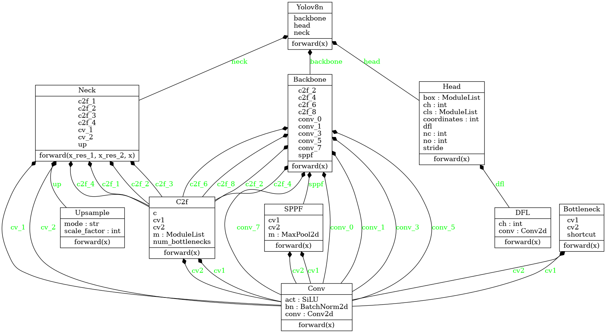

# YOLOv8n Implementation from Scratch

A complete implementation of YOLOv8 nano (YOLOv8n) object detection model built from scratch for educational purposes.

## Overview

This project implements the YOLOv8n (You Only Look Once version 8 nano) object detection algorithm from the ground up. YOLOv8n is the smallest and fastest variant of the YOLOv8 family, designed for real-time object detection with minimal computational requirements.
